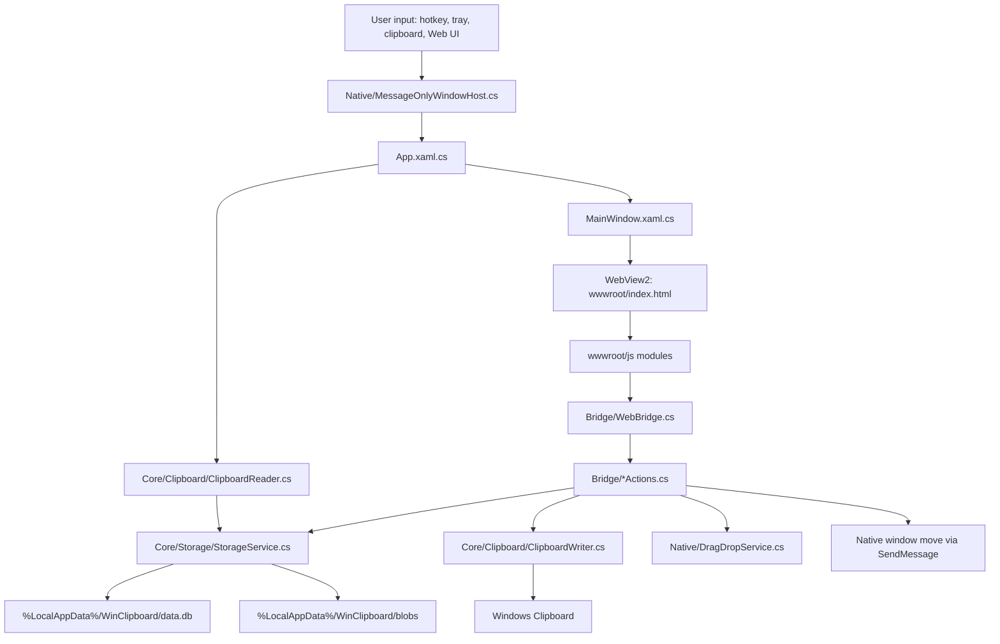
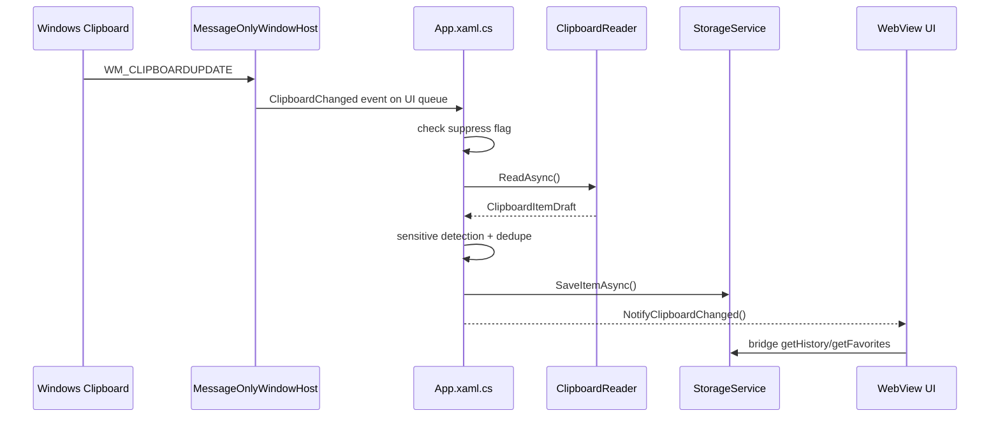
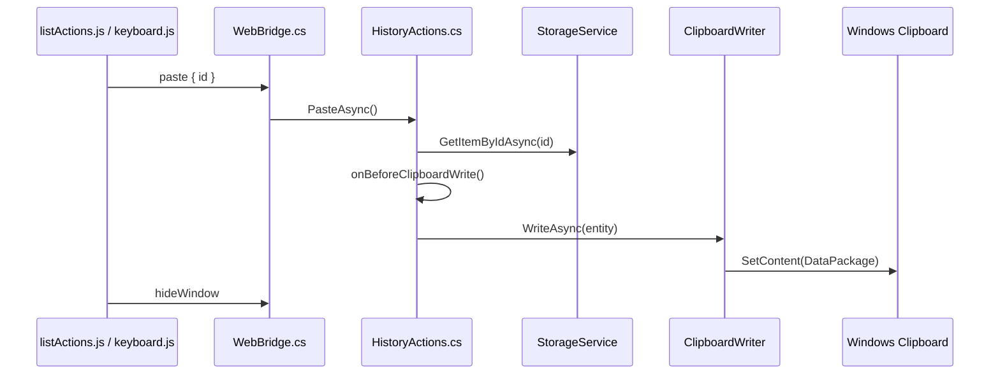
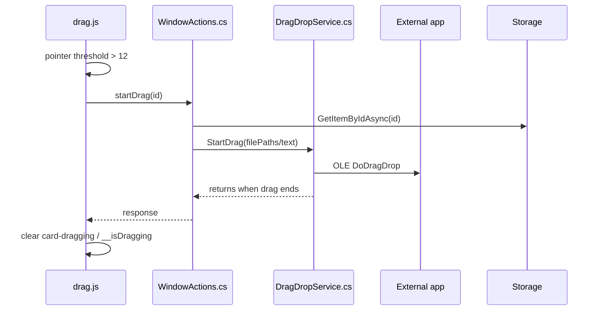
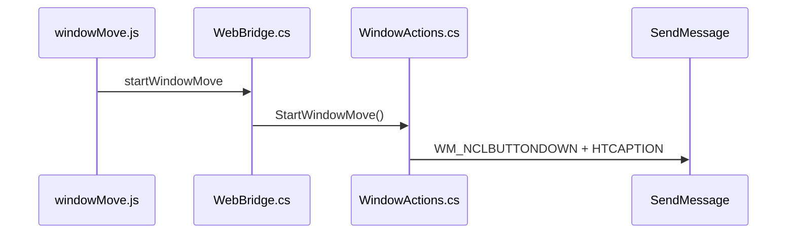

# WinClipboard System Map

本文档记录当前代码结构、运行链路、交互语义和待完成边界，供 architect、implementer、debugger 快速接手。

## Current Status

截至 2026-05-25，项目已完成一次主要边界拆分和一轮运行时体验修复。当前重点不是继续拆大文件，而是验收并硬化真实使用反馈：

- `FB01` 双击卡片粘贴：已实现 click counter，用户已反馈可用。
- `FB02` 粘贴立即关闭：已实现，不再等待 toast。
- `FB06` 帮助入口：顶部 `?` 和设置入口已可打开 help modal。
- `FB03` 预览可选中/右键退出：已有实现，仍需人工验收。
- `FB05` 窗口移动把手：已有实现，仍需人工验收。
- `FB04` 原生拖拽可靠性和图片拖拽：仍是最高风险剩余项。

最新任务卡：

- `docs/architecture/2026-05-24-runtime-ux-feedback-task-cards.md`

## High-Level Architecture



## Repository Layout

- `clip/clip.slnx`：Visual Studio solution。当前 CLI SDK 不支持此 `.slnx` XML 格式，勿作为本地验证入口。
- `clip/clip/clip.csproj`：.NET 8 WinExe，Windows App SDK、WinUI、WebView2、SQLite 依赖。
- `clip/clip/App.xaml.cs`：应用启动、单实例 mutex、存储初始化、剪贴板监听、热切换、清理定时器。
- `clip/clip/MainWindow.xaml(.cs)`：无边框置顶窗口、WebView2 宿主、窗口显示/隐藏/定位。
- `clip/clip/Bridge/`：WebView2 action 路由与分组 action。
- `clip/clip/Core/`：剪贴板读写、数据模型、加密、存储、OCR、设置。
- `clip/clip/Native/`：Win32 message-only window、托盘、热键、拖拽、P/Invoke。
- `clip/clip/wwwroot/`：真实前端，无 Node 构建链。
- `clip/clip/ViewModels/`：旧 WinUI MVVM 路径，当前主界面不依赖。

## Runtime Lifecycle

1. `App.OnLaunched()` 获取 `Local\WinClipboard.SingleInstance` mutex。已有实例时新进程直接退出。
2. 初始化 `StorageService`，打开 SQLite，执行迁移和索引创建。
3. 后台清理 3 天以上的非收藏、非敏感历史。
4. 启动 `MessageOnlyWindowHost`：
   - 创建 message-only HWND。
   - 注册主唤出热键，默认 Ctrl+Tab。
   - 注册纯文本粘贴热键 Ctrl+Shift+V。
   - 注册剪贴板监听。
   - 创建托盘图标和菜单。
5. 启动 `KeyboardHookService`，支持 Ctrl+V 连按热切换最近文本。
6. 用户热键/托盘唤出时，`MainWindow.ShowWindowAt()` 显示 WebView2 窗口。
7. 前端通过 `window.chrome.webview.postMessage()` 调用 bridge action。

## Frontend Startup

`wwwroot/app.js` 只做启动编排：

1. `i18n.applyTranslations()`
2. `history.bindEvents()`
3. `settings.bindEvents()`
4. `vault.bindEvents()`
5. `overlays.bindEvents()`
6. `settings.load()`
7. `history.refreshList()`
8. `keyboard.init()`
9. `drag.setupDragHandle()`
10. `windowMove.init()`

不要把业务逻辑加回 `app.js`。

## Frontend Modules

- `state.js`：共享状态、当前 tab、items、选中项、主题、panel/modal、缩略图缓存。
- `bridge.js`：`app.bridge.send()`、requestId、timeout、`__bridge_response`、`__on_clipboard_updated`、JS 错误日志。
- `i18n.js`：`t()`、`applyTranslations()`，接收后端语言切换推送。
- `history.js`：历史/收藏加载、`/img` `/file`、All/Text/Image/File chips、tab 和清空历史。
- `listView.js`：列表渲染、事件委托、preview action、manual double-click click counter、缩略图懒加载。
- `listActions.js`：选择、双击/显式粘贴、删除确认、收藏、tag。
- `keyboard.js`：Escape、Ctrl+F、方向键、Enter、Space、1-9、可选 `?` / `Shift+/` help、快捷键录制。
- `overlays.js`：preview modal、confirm modal、help modal、panel 互斥、window show/hide 动画、顶层 Escape 关闭。
- `settings.js`：设置面板、语言、主题、背景、遮罩、自启、帮助入口。
- `vault.js`：保险箱列表、搜索、新增、复制账号/密码、删除确认。
- `drag.js`：卡片拖拽到外部应用，维护 `.card-dragging` 和 `window.__isDragging`。
- `windowMove.js`：顶部窗口移动把手，调用 `startWindowMove` bridge action。
- `toast.js`：复制、收藏、删除、tag、保险箱复制等轻量反馈。

## Current Interaction Semantics

- Single click card：只选择。
- Double click card：粘贴并隐藏窗口。不要只依赖原生 `dblclick`，当前用 `DBLCLICK_WINDOW` click counter。
- Paste button：粘贴并隐藏窗口。
- Enter：粘贴选中项。
- Space：预览选中项。
- 1-9：快速粘贴对应序号。
- Preview button：预览，不粘贴。
- Escape：关闭最上层 modal/panel；没有顶层时隐藏窗口。
- Help：顶部 `?` icon 和 Settings -> 查看，均打开 `#help-modal`。
- Search：普通文本搜索，`/img`、`/file` 仍可用；chips 映射为 `all/text/image/files`。
- Drag card：超过阈值后触发 native drag/drop；失败或取消必须清理 dragging state。
- Move window：拖动 `#window-drag-handle`，通过 `startWindowMove` 让原生窗口移动。

## Bridge Action Map

`Bridge/WebBridge.cs` dispatch:

- History:
  - `getHistory(search, limit)`
  - `getFavorites(search, category)`
  - `paste(id)`
  - `delete(id)`
  - `toggleFavorite(id)`
  - `updateTag(id, tag)`
  - `clearHistory()`
- Vault:
  - `getSensitiveItems(search)`
  - `addSecret(alias, content, sensitiveType, username, remark)`
  - `deleteSecret(id)`
  - `decryptSecret(id)`
  - `getUsername(id)`
  - `pasteText(text)`
  - `updateAlias(id, alias)`
- Settings:
  - `getSettings()`
  - `setTheme(theme)`
  - `setLanguage(language)`
  - `selectBackgroundImage()`
  - `setBackground(path)`
  - `clearBackground()`
  - `setMaskOpacity(opacity)`
  - `getAutostart()`
  - `setAutostart(enabled)`
  - `setShortcut(modifiers, code)`
- Media:
  - `getImageThumbnail(id)`
  - `getFullText(id)` returns full text or file paths.
  - `showImagePreviewWindow(id)`
- Window/native:
  - `hideWindow()`
  - `log(level, message)`
  - `startDrag(id)`
  - `startWindowMove()`

## Clipboard Capture Flow



Important:

- 图片优先读取 bitmap，上限约 20 MB。
- 文件读取 storage items。
- 文本会做敏感内容识别。
- 图片 blob 使用 SHA256 去重。
- 粘贴或保险箱复制前必须设置 suppress flag，避免自写自读。

## Paste Flow



Current rule:

- 粘贴成功后立即隐藏窗口，不等待 toast。
- 若 bridge 返回失败，不应显示成功 toast 或隐藏窗口。

## Native Drag Flow



Risk:

- `DoDragDrop` 是阻塞式 native loop。
- 图片拖拽目前重点仍需真实 QQ/Codex 验收。
- `WindowActions.StartDragAsync()` 仍可能涉及 synthetic mouse state，调试时重点看卡住后 `__isDragging` 是否清理。

## Window Move Flow



Rules:

- 只允许移动把手触发窗口移动。
- 不要让整页可拖动，避免破坏卡片拖拽、搜索输入和预览文字选择。

## Data Model

SQLite `items` fields:

- Identity/type: `id`, `type`, `captured_at`, `tag`, `is_favorite`.
- Sensitive: `is_sensitive`, `sensitive_type`, `text_content`, `username`, `alias`, `remark`.
- Image: `image_blob`, `image_hash`, `image_w`, `image_h`, `ocr_text`.
- Files: `file_paths`.

DTO to JS:

- `id`, `type`, `tag`, `preview`, `colorHex`, `alias`.
- `isFavorite`, `isSensitive`, `sensitiveType`, `username`, `remark`.
- `capturedAt`, `timeAgo`, `hasImage`, `imageWidth`, `imageHeight`.

## Known Risks And Open Work

High priority:

- `FB03` Preview manual verification:
  - Text/file preview can select text.
  - Ctrl+C copies selected preview text.
  - Right-click closes only when no active selection.
  - Escape closes preview first.
- `FB05` Window move manual verification:
  - Handle moves window.
  - Does not affect card drag or preview selection.
- `FB04` Drag/drop:
  - Image drag into QQ/Codex.
  - Text drag into editor.
  - File drag into file-accepting target.
  - Cancel/fail drag cleanup.

Medium priority:

- Help content currently says “键盘快捷键”; task card wanted 操作提示 / Operation Tips. If product direction favors general tips, rename copy and include mouse actions.
- Static script checks many interactions, but cannot prove modal visual layer or native drag behavior.
- `WinClipboard.bridge.send()` still uses timeout behavior; UI should avoid treating timeout/null as success.
- `GetSettings()` has historical mask opacity mismatch risk; verify current behavior before changing.

Known build/package gaps:

- `dotnet build clip/clip.slnx` fails with `MSB4068` on current SDK.
- Default project build can enter MSIX packaging and fail with `APPX0002`.
- Use `scripts/verify-build.ps1` for local compile validation.

## Verification Matrix

Commands:

```powershell
powershell -ExecutionPolicy Bypass -File scripts\check-frontend-js.ps1
powershell -ExecutionPolicy Bypass -File scripts\check-interaction-affordance.ps1
powershell -ExecutionPolicy Bypass -File scripts\verify-build.ps1
powershell -ExecutionPolicy Bypass -File scripts\check-runtime-smoke.ps1
```

Manual:

- Hotkey toggles UI at cursor and Escape hides it.
- Text/image/file copies appear in history.
- Search works for text, `/img`, `/file`, and chips.
- Single click selects; double-click pastes; Enter pastes; Space previews; 1-9 quick-pastes.
- Preview text/file: select, Ctrl+C, right-click, Escape.
- Help icon and Settings -> 查看 open help modal.
- Move window by top handle.
- Card drag text/image/file to real external targets.
- Favorite/delete/tag actions work and refresh list.
- Vault add/copy/delete works; sensitive content remains masked.
- Theme, language, background image, mask opacity, autostart and hotkey recorder work.

Visual:

- Dark + pure Mica/Acrylic.
- Light + pure Mica/Acrylic.
- Dark + custom background image.
- Light + custom background image.
- Long text, image card, file card, empty list, empty vault, preview/help/confirm overlays.
