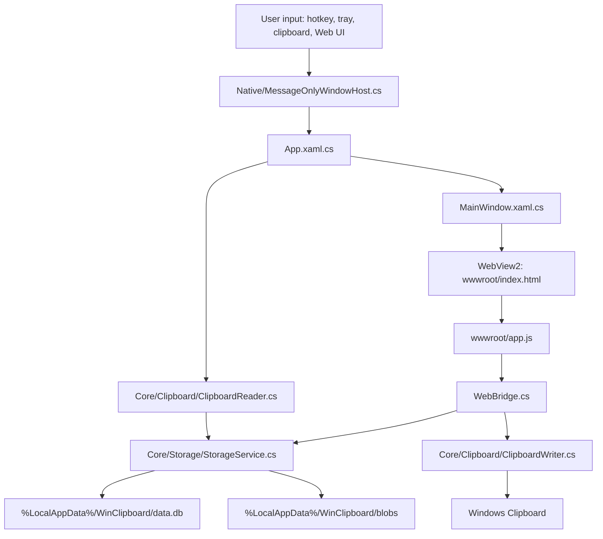
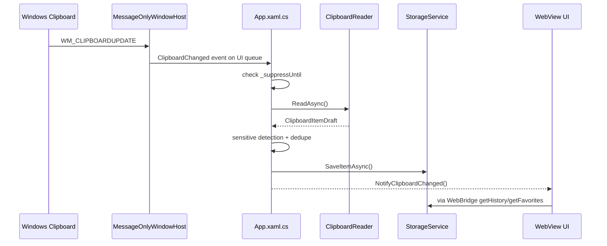
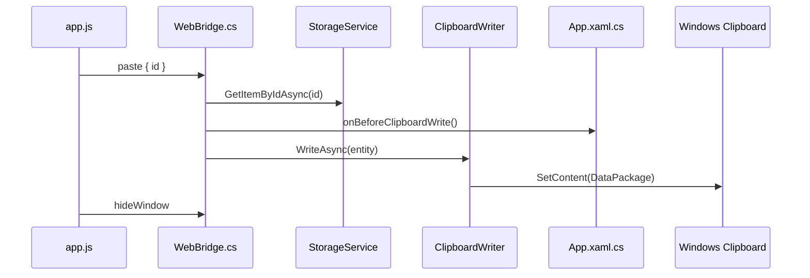

# WinClipboard System Map

本文档记录当前代码结构、运行链路和高风险边界，供 architect、implementer、debugger 快速进入项目。

## High-Level Architecture

## Repository Layout

- `clip/clip.slnx`：Visual Studio solution。
- `clip/clip/clip.csproj`：.NET 8 WinExe，Windows App SDK、WinUI、WebView2、SQLite 依赖；`wwwroot/**` 总是复制到输出目录。
- `clip/clip/App.xaml.cs`：应用启动、存储初始化、消息 host、剪贴板监听、热切换、定时清理。
- `clip/clip/MainWindow.xaml(.cs)`：无边框置顶窗口和 WebView2 宿主；负责透明背景、Mica/Acrylic、窗口定位、显示/隐藏动画触发。
- `clip/clip/Bridge/WebBridge.cs`：前端 action 到 C# 服务的薄路由层。
- `clip/clip/Bridge/*Actions.cs`：按 history、vault、settings、media、window 分组的 bridge action 实现。
- `clip/clip/Bridge/ClipboardItemDtoMapper.cs`：存储实体到前端 DTO 的映射。
- `clip/clip/Core/`：剪贴板读写、数据模型、加密、存储、OCR、设置。
- `clip/clip/Core/Storage/StorageService.cs`：公开 API facade，委托给 repo/connection/blob 类。
- `clip/clip/Core/Storage/StorageConnection.cs`：SQLite 连接、锁、底层 query/exec helpers。
- `clip/clip/Core/Storage/StorageMigrator.cs`：CREATE TABLE、ALTER TABLE 迁移、索引。
- `clip/clip/Core/Storage/BlobStore.cs`：blob 目录、SHA256、图片读写。
- `clip/clip/Core/Storage/ClipboardItemRepository.cs`：条目保存、历史/收藏查询、tag/favorite/delete/purge。
- `clip/clip/Core/Storage/VaultRepository.cs`：敏感条目列表、手动添加密钥、别名更新。
- `clip/clip/Native/`：Win32 message-only window、托盘、热键、拖拽、辅助 P/Invoke。
- `clip/clip/Native/GlobalHotkeyService.cs`：主快捷键注册/rebind、WM_HOTKEY 和 WM_APP_REBIND 处理。
- `clip/clip/Native/ClipboardListenerService.cs`：WM_CLIPBOARDUPDATE 监听与 UI 事件分发。
- `clip/clip/Native/PlainTextPasteService.cs`：Ctrl+Shift+V 纯文本读取/回写/粘贴。
- `clip/clip/wwwroot/`：当前真实前端；Vanilla HTML/CSS/JS，无 Node 构建链。
- `clip/clip/UI/HotSwitchToast.*`：Ctrl+V 连按热切换提示窗口。
- `clip/clip/ViewModels/`：旧 WinUI MVVM 路径，当前 WebView2 主界面不依赖它。

## Runtime Lifecycle

1. `App.OnLaunched()` 设置 WebView2 透明背景环境变量。
2. 初始化 `StorageService`，打开 SQLite，迁移缺失列，创建索引。
3. 后台清理 3 天以上的非收藏、非敏感历史。
4. 启动 `MessageOnlyWindowHost`：
   - 创建 message-only HWND。
   - 注册主唤出热键，默认 Ctrl+Tab。
   - 注册纯文本粘贴热键 Ctrl+Shift+V。
   - 注册剪贴板监听。
   - 创建托盘图标和右键菜单。
5. 启动 `KeyboardHookService`，支持 Ctrl+V 连按热切换最近文本。
6. 用户通过热键或托盘唤出窗口时，`MainWindow` 创建 WebView2 并加载 `https://app.local/index.html`。
7. 前端通过 `window.chrome.webview.postMessage()` 请求数据或执行动作。

Single-instance rule:

- `App.OnLaunched()` takes a per-user named mutex, `Local\WinClipboard.SingleInstance`.
- If another instance is already running, the new process exits before storage, WebView2, hotkeys, tray, or clipboard listener initialization.
- Runtime smoke uses `scripts/check-runtime-smoke.ps1` to clean stale `clip.exe` processes, launch the expected `win-x64\clip.exe`, assert only one instance remains after a second launch, then verify storage DB creation and clipboard marker capture.

## Clipboard Capture Flow

Important details:

- 图片优先读取 `StandardDataFormats.Bitmap`，上限约 20 MB。
- 文件读取 `StandardDataFormats.StorageItems`。
- 文本读取 `StandardDataFormats.Text`，会做敏感内容识别。
- 非收藏、非敏感历史会被 3 天清理策略影响。
- 图片 blob 使用 SHA256 去重，存储在 `%LocalAppData%/WinClipboard/blobs`。

## Paste Flow

Risk points:

- `ClipboardWriter.WriteAsync()` 当前对敏感文本不会自动解密；保险箱复制走 `decryptSecret` + `pasteText`。
- 粘贴前必须设置 suppress flag，否则写回剪贴板可能又被监听成新历史。
- UI 单击卡片直接粘贴，与选择、预览、拖拽之间存在语义冲突。

## Frontend Map

`wwwroot/index.html`：

- 顶部 segmented control：历史/收藏。
- 顶部 icon actions：设置、保险箱、清空历史。
- 搜索栏：普通搜索，`/img` 和 `/file` 类型过滤。
- 主列表：`#item-list` 由 `renderList()` 整体 innerHTML 重绘。
- 覆盖层：设置面板、保险箱面板、文本预览 modal、添加保险箱 modal、确认 modal。

`wwwroot/app.js` 当前只负责启动编排：`DOMContentLoaded` 后应用翻译、加载设置、刷新列表、初始化键盘和拖拽入口。

`wwwroot/js/` 前端模块：

- `state.js`：创建 `window.WinClipboard` 命名空间，维护当前 tab、列表、选中项、主题、面板/模态状态和缩略图缓存。
- `bridge.js`：`WinClipboard.bridge.send()`、`window.__bridge_response()`、剪贴板更新回调和 JS 错误日志桥接。
- `i18n.js`：`t()`、`applyTranslations()`；保留后端 `setLanguage` 仍会调用的全局函数。
- `history.js`：历史/收藏加载、`/img` 与 `/file` 搜索解析、tab 切换和清空历史确认入口。
- `listView.js`：卡片 DOM 渲染、事件委托、懒加载缩略图、选中项滚动、HTML 转义和类型/标签图标。
- `listActions.js`：卡片选择、单击选择、双击/显式按钮粘贴、删除、收藏、标签更新。
- `drag.js`：document-level pointer drag 识别、`startDrag` bridge 调用和拖拽后的 anti-click shield。
- `keyboard.js`：Escape、Ctrl+F、方向键、Enter、Space、1-9、搜索 debounce 和全局快捷键录制。
- `settings.js`：主题、语言、背景图、遮罩、自启和快捷键显示设置。
- `vault.js`：敏感保险箱列表、搜索、新增、复制账号/密码、删除。
- `overlays.js`：设置/保险箱面板互斥、预览、确认框、窗口显示/隐藏动画、Escape 顶层关闭顺序。

前端兼容层状态：

- `index.html` 不再使用 `onclick`、`onchange`、`oninput` inline handlers。
- 列表卡片和保险箱生成 HTML 不再使用 inline handlers，改由 `listView.js` 与 `vault.js` 做事件委托。
- 仍保留的 C# 回调全局函数：`window.__bridge_response`、`window.__on_clipboard_updated`、`window.__on_window_shown`、`window.hideWindowAnimated`。

文案和样式边界：

- `locales/zh.json`、`locales/en.json` 负责可见 UI 文案，包括保险箱、确认框、快捷键录制提示和操作按钮标题。
- `styles.css` 负责设置面板、保险箱新增 modal、确认框、预览 loading、标签颜色和 vault remark 等视觉样式；`index.html` 与生成 HTML 不再承载 `style=` 属性。

`wwwroot/styles.css` 主要层次：

- `:root` 和 `[data-theme="dark"]` 定义主题变量。
- 三层背景：`#bg-layer`、`#overlay-layer`、`#content-layer`。
- 列表卡片、图片卡片、hover actions、selected ring。
- settings/vault panel、preview modal、confirm modal。

## Bridge Action Map

完整请求/响应协议见 `docs/architecture/bridge-action-protocol.md`。后端拆分后的 owner：

- `Bridge/WebBridge.cs`：解析 JSON、按 action dispatch、统一回写 `window.__bridge_response(...)`。
- `Bridge/BridgeRequest.cs`：action、requestId 和 `JsonElement` 生命周期封装。
- `Bridge/BridgeResponse.cs`：标准 `{ success: false, error }` 失败响应辅助。
- `Bridge/HistoryActions.cs`：history/favorites/delete/favorite/tag/clear/paste。
- `Bridge/VaultActions.cs`：vault list/add/delete/decrypt/username/pasteText/updateAlias。
- `Bridge/SettingsActions.cs`：settings/theme/language/background/mask/autostart/shortcut。
- `Bridge/MediaActions.cs`：thumbnail/full text/image preview。
- `Bridge/WindowActions.cs`：hide/log/startDrag/background picker。
- `Bridge/ClipboardItemDtoMapper.cs`：masked preview、color detection、timeAgo 和 media metadata DTO 映射。

History and favorites:

- `getHistory(search, limit)` -> list of mapped entities.
- `getFavorites(search, category)` -> list of favorites, optional category filter.
- `paste(id)` -> write item to clipboard (with suppress flag).
- `delete(id)` -> delete item.
- `toggleFavorite(id)` -> flip favorite.
- `updateTag(id, tag)` -> update tag.
- `clearHistory()` -> delete non-favorite, non-sensitive history.

Sensitive vault:

- `getSensitiveItems(search)` -> sensitive list.
- `addSecret(alias, content, sensitiveType, username, remark)` -> encrypted insert.
- `deleteSecret(id)` -> delete item.
- `decryptSecret(id)` -> returns decrypted text.
- `getUsername(id)` -> returns username.
- `pasteText(text)` -> writes plain text to clipboard.

Settings:

- `getSettings()` -> theme, background, language, hotkey, autostart.
- `setTheme(theme)` -> persist and update DWM theme.
- `setLanguage(language)` -> persist and push locale JSON to JS.
- `selectBackgroundImage()` -> WinUI picker, copies image to local folder, returns base64.
- `setBackground(path)`, `clearBackground()`, `setMaskOpacity(opacity)`.
- `getAutostart()`, `setAutostart(enabled)`.
- `setShortcut(modifiers, code)` -> rebinds main hotkey.

Preview and media:

- `getImageThumbnail(id)` -> returns full image as base64 data URI.
- `getFullText(id)` -> returns full text or file paths.
- `showImagePreviewWindow(id)` -> opens native preview window.

Window and diagnostics:

- `hideWindow()` -> immediate native hide.
- `log(level, message)` -> Debug.WriteLine from JS.
- `startDrag(id)` -> starts native drag/drop for text/image/files.
- `selectBackgroundImage()` -> WinUI file picker; copies to local folder; returns base64.

## Data Model

SQLite table `items`:

- Identity and classification: `id`, `type`, `captured_at`, `tag`, `is_favorite`.
- Sensitive fields: `is_sensitive`, `sensitive_type`, `text_content`, `username`, `alias`, `remark`.
- Image fields: `image_blob`, `image_hash`, `image_w`, `image_h`, `ocr_text`.
- File fields: `file_paths`.

Mapped entity sent to JS includes:

- `id`, `type`, `tag`, `preview`, `colorHex`, `alias`.
- `isFavorite`, `isSensitive`, `sensitiveType`, `username`, `remark`.
- `capturedAt`, `timeAgo`, `hasImage`, `imageWidth`, `imageHeight`.

## Native Integration Map

- `MessageOnlyWindowHost.cs` owns HWND thread, message pump, WndProc routing, tray menu; delegates hotkey/clipboard/paste to focused services.
- `GlobalHotkeyService.cs` handles hotkey registration, WM_HOTKEY dispatch, and thread-affine rebind.
- `ClipboardListenerService.cs` handles WM_CLIPBOARDUPDATE and dispatches UI events.
- `PlainTextPasteService.cs` reads plain Unicode text from clipboard and performs synthetic Ctrl+V paste.
- `KeyboardHookService.cs` detects Ctrl+V presses for hot-switch behavior.
- `DragDropService.cs` bridges Web UI card dragging into native drag/drop.
- `Win32Helper.cs` and `Win32Helper.Clipboard.cs` centralize P/Invoke constants and helpers.
- `TrayIconService.cs` owns notification icon lifecycle.

Threading rule:

- HWND-bound hotkey operations must run on the message window thread. `RebindHotKey()` uses `WM_APP_REBIND` to marshal onto the correct thread.
- UI operations must be enqueued through `DispatcherQueue`.

## Known Design and Operation Issues

Frontend design:

- Visual hierarchy is compact but crowded: segmented tabs, search, three icon buttons, list cards and hover actions compete in a 380 x 560 window.
- Emoji and inline SVG/icons are mixed; card actions use symbols like star, dot and x, while top actions use SVG.
- Settings/vault/add modal inline styles and hardcoded text have been moved into `styles.css` and locale JSON. Remaining visual debt is icon/style normalization.
- Transparent/Mica styling makes contrast fragile; card, panel and overlay opacity must be tested in multiple modes.

Operation logic:

- Single click selects; double-click or paste button (→) pastes; Enter pastes selected; Space previews; 1-9 quick-pastes.
- `renderList()` rebuilds all card DOM after many state changes, which resets transient UI state and may become slow with large lists.
- Drag shield uses `window.__isDragging` and timeouts; it prevents accidental click after drag but is timing-sensitive.
- `WinClipboard.bridge.send()` resolves `null` on timeout for most actions, so UI still cannot always distinguish timeout from a valid empty response.
- Keyboard shortcut logic has been isolated in `keyboard.js`, but modal/panel focus rules still need careful regression testing.

Backend risk:

- `WebBridge.HandleMessageAsync()` now returns `{ success: false, error }` for request-scoped exceptions, but action-level response shapes are still mixed between raw arrays and `{ success }` objects.
- `GetSettings()` currently hardcodes `maskOpacity = 0.3` and `blurAmount = 30.0`, while `setMaskOpacity` persists another value.
- Current local compile verification uses `scripts/verify-build.ps1`. `dotnet build clip/clip.slnx` is not supported by the installed .NET 8 SDK because the SDK/MSBuild does not understand the `.slnx` XML solution format. Default project build reaches MSIX packaging before failing in `WinAppSdkGenerateAppxPackageRecipe`; keep that as the packaging path to fix separately.

## Suggested Optimization Path

Phase 1: Interaction semantics

- Keep the chosen card semantics stable: single click selects; double-click or explicit paste button pastes.
- Make preview, paste, drag and card actions visually discoverable and non-conflicting.
- Give all destructive actions consistent confirm behavior.

Phase 2: UI structure

- Keep inline styles out of `index.html` and generated HTML strings.
- Keep i18n coverage for vault, confirm, action titles and validation messages.
- Normalize icon style and button states.

Phase 3: JS boundaries

- Split or at least section `app.js` by responsibility: bridge, state, list, keyboard, overlays, settings, vault.
- Introduce a small state/update layer so list selection and panel state are explicit.
- Standardize bridge error handling.

Phase 4: Performance and scale

- Add pagination or virtual list for history beyond 200 items.
- Avoid base64-loading full images as thumbnails; generate/store smaller thumbnails if image history grows.
- Reduce full `innerHTML` list redraws where possible.

## Verification Matrix

Build:

- Stable local compile: `powershell -ExecutionPolicy Bypass -File scripts/verify-build.ps1`.
- Equivalent command: `dotnet build clip/clip/clip.csproj /p:WindowsPackageType=None /p:EnableMsixTooling=false /p:DisableMsixProjectCapabilityAddedByProject=true /p:GenerateAppxPackageOnBuild=false /p:AppxPackage=false`.
- Frontend syntax: `powershell -ExecutionPolicy Bypass -File scripts/check-frontend-js.ps1`.
- Runtime smoke: `powershell -ExecutionPolicy Bypass -File scripts/check-runtime-smoke.ps1`.
- Known packaging gap: default `dotnet build clip/clip/clip.csproj` still enters MSIX packaging and fails in `WinAppSdkGenerateAppxPackageRecipe` with `APPX0002`.
- Known solution gap: `dotnet build clip/clip.slnx` fails with `MSB4068` on the pinned .NET 8 SDK; use the project compile script until the SDK/solution format is updated.
- If output is locked, close the running `clip.exe` before rebuilding. Avoid concurrent builds against this project because XAML markup compilation writes shared `obj/.../input.json`.

Manual functional checks:

- Hotkey toggles UI at cursor and Escape hides it.
- Text/image/file copies appear in history.
- Search works for text, `/img`, `/file`, and OCR text when available.
- Enter pastes selected item; Space previews; 1-9 quick-pastes.
- Card drag works without accidental paste.
- Favorite/delete/tag actions work and refresh list correctly.
- Vault add/copy/delete works; sensitive text is masked in normal list.
- Theme, language, background image, mask opacity, autostart and hotkey recorder work.

Visual checks:

- Dark + pure Mica/Acrylic.
- Light + pure Mica/Acrylic.
- Dark + custom background image.
- Light + custom background image.
- Long text, image card, file card, empty list, empty vault, modal overlays.
